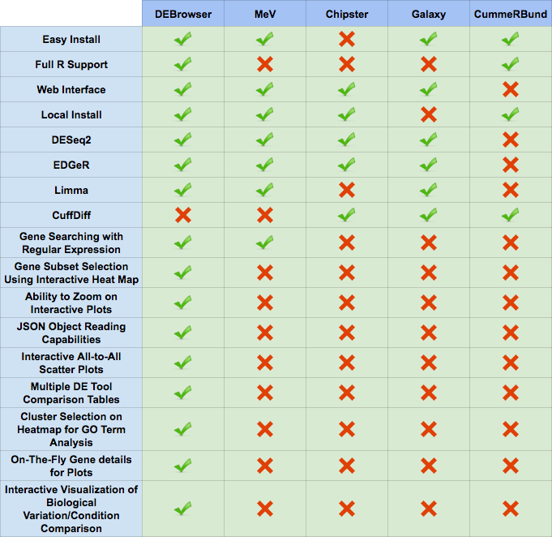

***************
DE Analysis
***************

This guide contains a breif discription of DESeq2 used within the DEBrowser

Introduction
============

Differential gene expression analysis has become an increasingly popular tool
in determining and viewing up and/or down experssed genes between two sets of
samples.  The goal of Differential gene expression analysis is to find genes
or transcripts whose difference in expression, when accounting for the
variance within condition, is higher than expected by chance.  `DESeq2
<https://bioconductor.org/packages/release/bioc/html/DESeq2.html>`_ is an R
package available via Bioconductor and is designed to normalize count data
from high-throughput sequencing assays such as RNA-Seq and test for
differential expression (Love et al. 2014).  For more information on the
DESeq2 algorithm, you can visit `this website <https://bioconductor.org/packages/release/bioc/vignettes/DESeq2/inst/doc/DESeq2.pdf>`_  With multiple parameters such as padjust values, log fold changes, and plot styles, altering plots
created with your DE data can be a hassle as well as time consuming.  The
Differential Expression Browser uses DESeq2, EdgeR, and Limma coupled with shiny to produce
real-time changes within your plot queries and allows for interactive browsing
of your DESeq results. In addition to DESeq analysis, DEBrowser also offers
a variety of other plots and analysis tools to help visualize your data
even further.

DESeq2
=========

For the details please check the user guide.
`DESeq2 userguide <https://www.bioconductor.org/packages/release/bioc/vignettes/DESeq2/inst/doc/DESeq2.pdf>`_

DESeq2 performs multiple steps in order to analyze the data you've provided for it.
The first step is to indicate the condition that each column (experiment) in the table represent.
You can group multiple samples into one condition column.
DESeq2 will compute the probability that a gene is differentially expressed (DE) for ALL genes in the table. It outputs
both a nominal and a multiple hypothesis corrected p-value (padj) using a negative binomial distribution.

Un-normalized counts
====================
DESeq2 rquires count data as input obtained from RNA-Seq or another high-thorughput sequencing experiment in the form of matrix values. Here we convert un-integer values to integer to be able to run DESeq2. The matrix values should be un-normalized, since DESeq2 model internally corrects for library size. So, transformed or normalized values such as counts scaled by library size should not be used as input. Please use edgeR or limma for normalized counts.

Used parameters for DESeq2
==========================
  - fitType:
     either "parametric", "local", or "mean" for the type 
     of fitting of dispersions to the mean intensity. 
     See estimateDispersions for description.

  - betaPrior: 
     whether or not to put a zero-mean normal prior
     on the non-intercept coefficients See nbinomWaldTest for 
     description of the calculation of the beta prior. By default, 
     the beta prior is used only for the Wald test, but can also be 
     specified for the likelihood ratio test.

  - testType: 
     either "Wald" or "LRT", which will then use either 
     Wald significance tests (defined by nbinomWaldTest), or the 
     likelihood ratio test on the difference in deviance between a 
     full and reduced model formula (defined by nbinomLRT)

  - rowsum.filter: 
     regions/genes/isoforms with total count (across all samples) below this value will be filtered out

EdgeR
========
For the details please check the user guide.
`EdgeR userguide <https://www.bioconductor.org/packages/release/bioc/vignettes/edgeR/inst/doc/edgeRUsersGuide.pdf>`_.

Used parameters for EdgeR
=========================

  - Normalization:
     Calculate normalization factors to scale the raw 
     library sizes. Values can be "TMM","RLE","upperquartile","none".

  - Dispersion:
     either a numeric vector of dispersions or a character 
     string indicating that dispersions should be taken from the data 
     object.

  - testType: 
     exactTest or glmLRT. exactTest: Computes p-values for differential 
     abundance for each gene between two samples, conditioning 
     on the total count for each gene. The counts in each group are assumed to 
     follow a binomial distribution. 
     glmLRT: Fits a negative binomial generalized log-linear model to the read 
     counts for each gene and conducts genewise statistical tests.
     
  - rowsum.filter: 
     regions/genes/isoforms with total count (across all samples) below this value will be filtered out
  
Limma
========
For the details please check the user guide.
`Limma userguide <https://bioconductor.org/packages/release/bioc/vignettes/limma/inst/doc/usersguide.pdf>`_.

Limma is a package to analyse of microarray or RNA-Seq data. If data is normalized with spike-in or any other scaling, tranforamtion or normalization method, Limma can be ideal. In that case, prefer limma rather than DESeq2 or EdgeR.

Used parameters for Limma
=========================

  - Normalization: 
     Calculate normalization factors to scale the raw library sizes. Values can be "TMM","RLE","upperquartile","none".
  
  - Fit Type: 
     fitting method; "ls" for least squares or "robust" for robust regression
  
  - Norm. Bet. Arrays: 
     Normalization Between Arrays; Normalizes expression intensities so that the    
     intensities or log-ratios have similar distributions across a set of arrays.

  - rowsum.filter:
     regions/genes/isoforms with total count (across all samples) below this value will be filtered out

ComBat
=========
For more details on ComBat, please check the user guide.
`ComBat userguide <https://bioconductor.org/packages/release/bioc/vignettes/sva/inst/doc/sva.pdf>`_.

ComBat is part of the SVA R Bioconductor package which specializes in corecting for known batch effects.
No additional parameters are selected or altered when running SVA's ComBat.

DEBrowser
=========

DEBrowser utilizes `Shiny <http://shiny.rstudio.com/>`_, a R based application development tool that creates a wonderful interactive user interface (UI)
combinded with all of the computing prowess of R.  After the user has selected the data to analyze and has used the shiny
UI to run DESeq2, the results are then input to DEBrowser.  DEBrowser manipulates your results in a way that allows for
interactive plotting by which changing padj or fold change limits also changes the displayed graph(s).
For more details about these plots and tables, please visit our quickstart guide for some helpful tutorials.

For comparisons against other popular data visualization tools, see the table below.

	
For more information on the programs compared against DEBrowser, please visit these pages:

	* `MeV <http://www.tm4.org/mev.html>`_
	
	* `Chipster <http://chipster.csc.fi>`_
	
	* `Galaxy <https://usegalaxy.org/>`_
	
	* `CummeRbund <http://compbio.mit.edu/cummeRbund/>`_

References
==========

1. Anders,S. et al. (2014) HTSeq - A Python framework to work with high-throughput sequencing data.

2. Chang,W. et al. (2016) shiny: Web Application Framework for R.

3. Chang,W. and Wickham,H. (2015) ggvis: Interactive Grammar of Graphics.

4. Giardine,B. et al. (2005) Galaxy: a platform for interactive large-scale genome analysis. Genome Res., 15, 1451–1455.

5. Howe,E.A. et al. (2011) RNA-Seq analysis in MeV. Bioinformatics, 27, 3209–3210.

6. Kallio,M.A. et al. (2011) Chipster: user-friendly analysis software for microarray and other high-throughput data. BMC Genomics, 12, 507.

7. Li,B. and Dewey,C.N. (2011) RSEM: accurate transcript quantification from RNA-Seq data with or without a reference genome. BMC Bioinformatics, 12, 323.

8. Love,M.I. et al. (2014) Moderated estimation of fold change and dispersion for RNA-seq data with DESeq2. Genome Biol., 15, 550.

9. Reese,S.E. et al. (2013) A new statistic for identifying batch effects in high-throughput genomic data that uses guided principal component analysis. Bioinformatics, 29, 2877–2883.

10. Reich,M. et al. (2006) GenePattern 2.0. Nat. Genet., 38, 500–501.

11. Risso,D. et al. (2014) Normalization of RNA-seq data using factor analysis of control genes or samples. Nat. Biotechnol., 32, 896–902.

12. Ritchie,M.E. et al. (2015) limma powers differential expression analyses for RNA-sequencing and microarray studies. Nucleic Acids Res., 43, e47–e47.

13. Trapnell,C. et al. (2012) Differential gene and transcript expression analysis of RNA-seq experiments with TopHat and Cufflinks. Nat. Protoc., 7, 562–578.

14. Vernia,S. et al. (2014) The PPAR$\alpha$-FGF21 hormone axis contributes to metabolic regulation by the hepatic JNK signaling pathway. Cell Metab., 20, 512–525.

15. Murtagh, Fionn and Legendre, Pierre (2014). Ward's hierarchical agglomerative clustering method: which algorithms implement Ward's criterion? Journal of Classification 31 (forthcoming).

16. Johnson et al. (2007) Adjusting batch effects in microarray expression data using empirical Bayes methods.  Biostatistics, 8, 118-127.
