*****************
Quick-start Guide
*****************

This guide is walkthrough for the DESeq Browser from start to finish.

Getting Started
===============

First off, we need to head to the DEBrowser webpage at this url:

http://debrowser.umassmed.edu/

Alternatively, if you have the R package installed, you can call these R commands:

library(debrowser)

startDEBrowser()

For more information on installing DEBrowser locally, please consult our Local Install Guide.

Once you've made your way to the website, or you have a local instance of DEBrowser running, you will be greeted with this tab on the left:

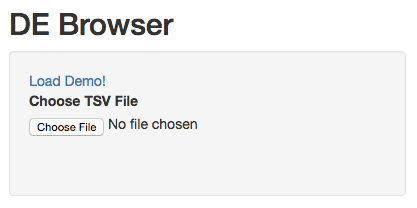

To begin the DESeq process, you will need to select your Data file (TSV format) to be analyzed using DESeq2.
If you do not have a dataset to use, you can select to use the built in demo by clicking on the 'Load Demo!'.
To view the entire demo data file, you can download this `demo set`_.  For an example case study, try our `advanced demo`_.

.. _demo set: http://bioinfo.umassmed.edu/pub/debrowser/simple_demo.tsv

.. _advanced demo: http://bioinfo.umassmed.edu/pub/debrowser/advanced_demo.tsv

The TSV files used to describe the quantification counts are similar to this:

IE:

=====  =====  =====  =====  =====  =====
gene   trans   exp1   exp2  cont1  cont2
=====  =====  =====  =====  =====  =====
DQ714  uc007   0.00   0.00   0.00   0.00
DQ554  uc008   0.00   0.00   0.00   0.00
AK028  uc011   2.00   1.29   0.00   0.00
=====  =====  =====  =====  =====  =====

DEBrowser also accepts TSV's via hyperlink by following a few conversion steps.  First, using the API provided by
Dolphin, we will convert TSV into an html represented TSV using this website:

*http://dolphin.umassmed.edu/public/api/*

The Two parameters it accepts (and examples) are:

	1. source=http://bioinfo.umassmed.edu/pub/debrowser/advanced_demo.tsv
	2. format=JSON
	
Leaving you with a hyperlink for:

*http://dolphin.umassmed.edu/public/api/?source=http://bioinfo.umass*

*med.edu/pub/debrowser/advanced_demo.tsv&format=JSON*

Next you will need to encode the url so you can pass it to the DEBrowser website.
You can find multiple url encoders online, such as the one located at this
web address: http://www.url-encode-decode.com/.

Encoding our URL will turn it into this:

*http%3A%2F%2Fdolphin.umassmed.edu%2Fpublic%2Fapi%2F%3Fsource%3Dhttp*

*%3A%2F%2Fbioinfo.umassmed.edu%2Fpub%2Fdebrowser%2Fadvanced_demo.tsv*

*%26format%3DJSON*

Now this link can be be used in debrowser as:

*http://debrowser.umassmed.edu:443/debrowser/R/*

It accepts two parameters:

	1. *jsonobject=http%3A%2F%2Fdolphin.umassmed.edu%2Fpublic%2Fapi%2F%3F*
	
	   *source%3Dhttp%3A%2F%2Fbioinfo.umassmed.edu%2Fpub%2Fdebrowser%2F*
	   
	   *advanced_demo.tsv%26format%3DJSON*
	2. *title=no*

The finished product of the link will look like this:

*http://debrowser.umassmed.edu:443/debrowser/R/?jsonobject=http://do*

*lphin.umassmed.edu/public/api/?source=http://bioinfo.umassmed.edu/p*

*ub/debrowser/advanced_demo.tsv&format=JSON&title=no*

Inputting this URL into your browser will automatically load in that tsv to be analyzed by DEBrowser!

For more information about the input file, please visit our DESeq/DEBrowser tab within Readthedocs.
Once you've selected your file and the upload has completed, you will then be shown the samples listed within your
file uploaded as well as a few options.

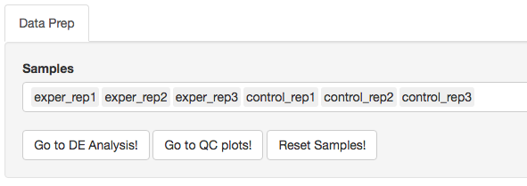

The first option, 'Go to DE Analysis', takes you to the next step within the DESeq workflow.
In order to run DESeq on your input data you first need to select which samples will go into your
conditions.  You can run multiple condition comparisons and view the results seperately as well.
To remove samples from a condition, simply select the sample you wish to remove and hit the delete/backspace key.
To add a sample to a condition you simply have to click on one of the condition text boxes to bring up a list of
samples you can add to that comparison.  Click on the sample you wish to add from the list and it will be added
to the textbox for that comparison.

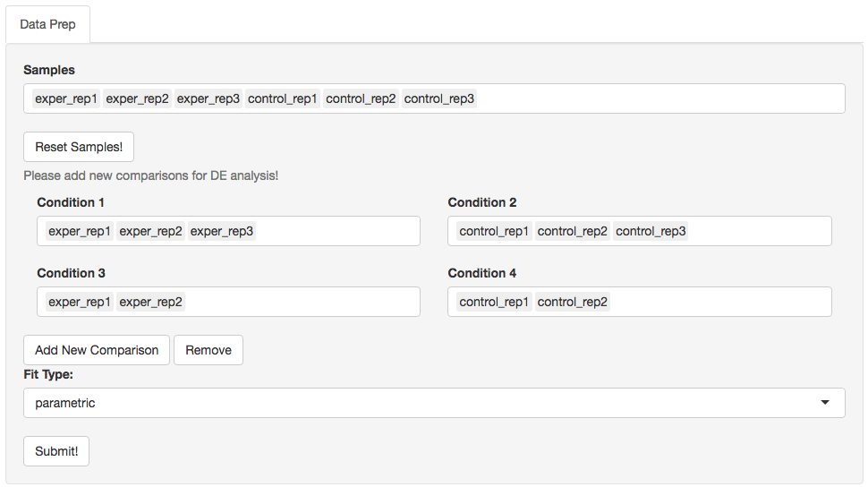

The second option, 'Go to QC plots!', takes you to a page where you can view quality control metrics on your data input.
The page opens with an all-to-all plot displaying the correlation between each sample.  Left of this plot is a panel which
contains various parameters to alter the look of your plot such as width and height.  You can change the type of dataset
being viewed within these QC plots by selecting the dataset you want at the top of the left panel.  Each dataset can have its
own unique parameters to change and alter your QC plots.  

In addition to the all-to-all plot,
you can also view a heatmap representation of your data as well as a Principal Component Analysis (PCA) plot by selecting
the specific plot option on the left panel under 'QC Plots'.  You can also select the type of clustering and distance method for
the heatmap produced to further customize your quality control measures.  Additionally, you can also view a density plot for your
sample data for your raw data and the data after normalization (Figure 6).
IQR and Density plots are another great visualization too to help you spot
outliers within your sample data incase you want to remove or look into
any possible discrepancies.

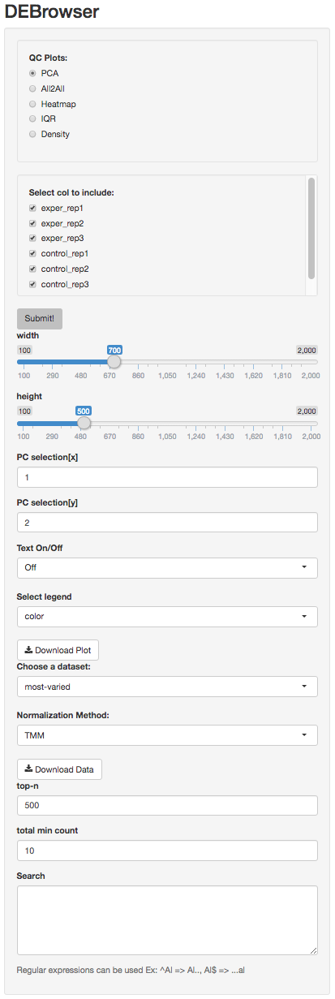

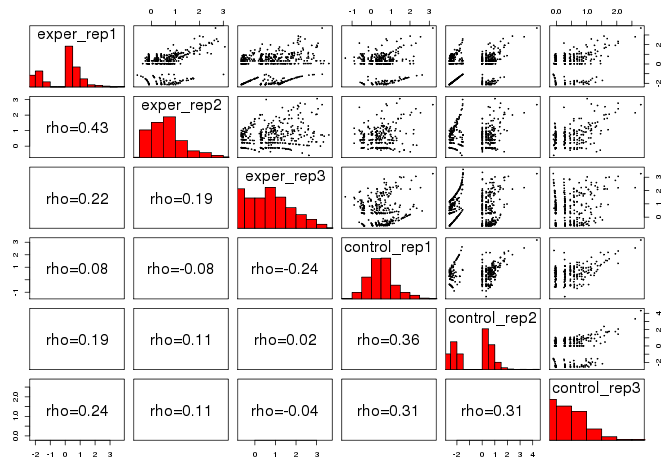
	
.. image:: ../debrowser_pics/intro_qc_heatmap.png
	:align: center
	
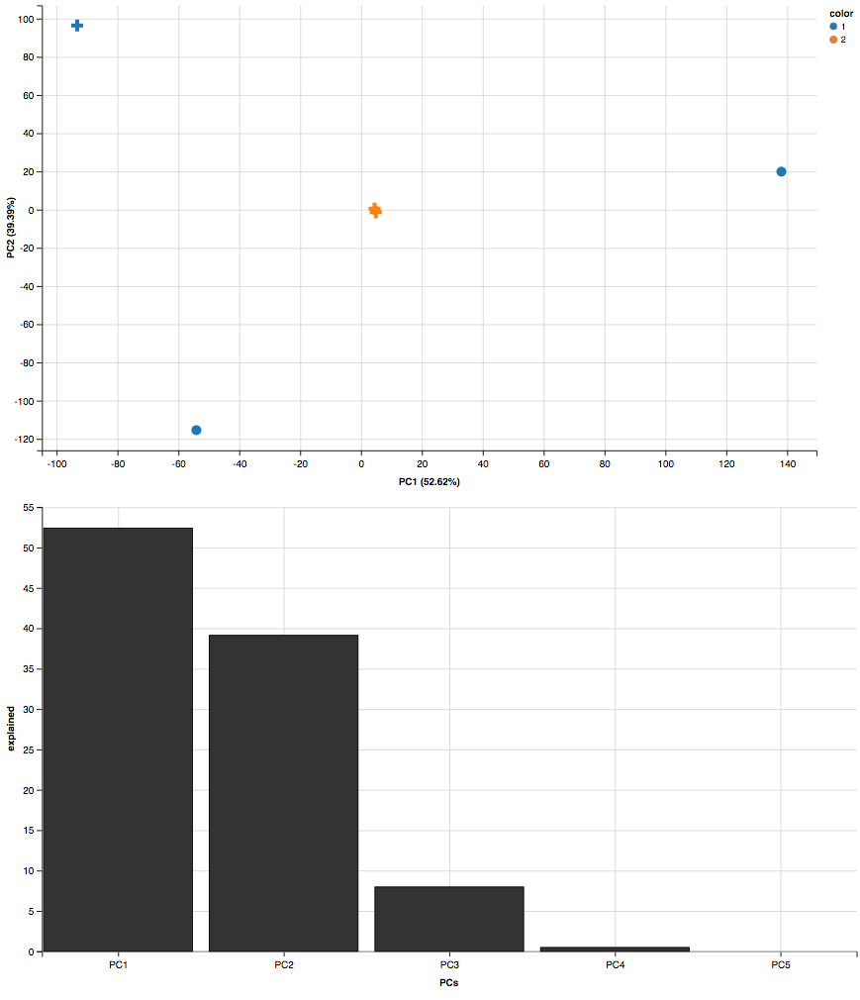
	
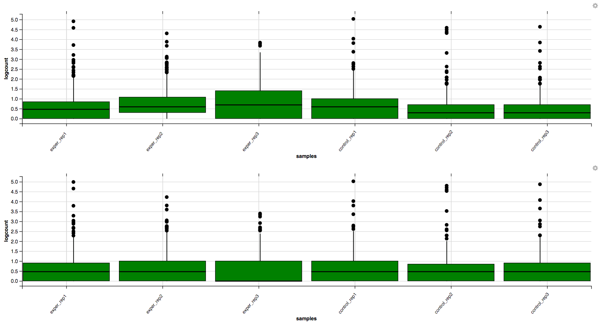
	
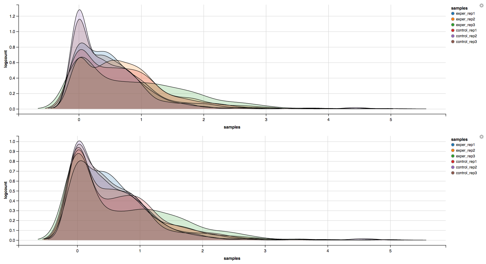

You can also view specific tables of your input data for each type of dataset available and search for a specific geneset
by inputting a comma-seperated list of genes or regex terms to search for in the search box within the left panel.
To view these tables, you must select the tab labeled 'Tables' as well as the dataset from the dropdown menu on the left panel.

If you ever want to change your file/condition parameters, or even ad a new set of comparisons, you can always
return to the 'Data Prep' to change and resubmit your data.  To completely start over, you can also hit the 'Reset'
button on the 'Data Prep' page.

Once you are happy with your dataset and you have selected your conditions within the 'DE Analysis' section,
you can then hit 'Submit!' to begin.

The Main Plots
==============

After clicking on the 'Submit!' button, DESeq2 will analyze your comparisons
and store the results into seperate data tables.  Shiny will then allow you
to access this data, with multiple interactive features, at the click of a
button.  It is important to note that the resulting data produced from DESeq
is normalized. Upon finishing the DESeq analysis, a tab based menu will appear
with multiple options.

.. image:: ../debrowser_pics/info_tabs.png
	:align: center

The first tab, the 'Main Plots' section, is where you will be able to view
the interactive results plots.  Plot choices include:

Scatter plot

.. image:: ../debrowser_pics/scatter_plot.png
	:align: center

Volcano plot

.. image:: ../debrowser_pics/volcano.png
	:align: center
	
MA plot

.. image:: ../debrowser_pics/ma.png
	:align: center
	
You can hover over the scatterplot points to display more information about the point selected.
A few bargraphs will be generated for the user to view as soon as a scatterplot point is hovered over.

.. image:: ../debrowser_pics/bargraph.png
	:align: center
	
.. image:: ../debrowser_pics/barplot.png
	:align: center
	
You can also select a specific region within the scatter plot and zoom in on the selected window.

.. image:: ../debrowser_pics/scatter_plot_selection.png
	:align: center
	
Once you've selected a specific region, a new scatterplot of the selected area will appear on the right

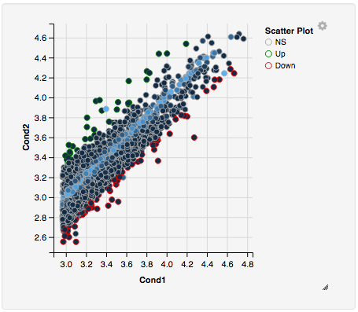
	
You also have a wide array of options when it comes to fold change cut-off levels, padj cut-off values,
which comparison set to use, and dataset of genes to analyze. 

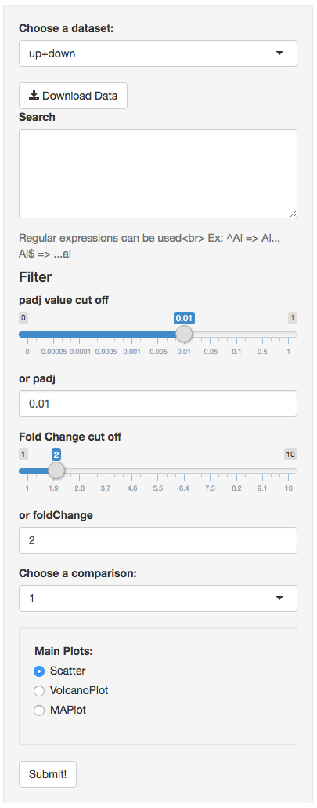

It is important to note that when conducting multiple comparisons, the
comparisons are labeled based on the order that they are input.
If you don't remember which samples are in your current comparison
you can always view the samples in each condition at the top of the main plots.

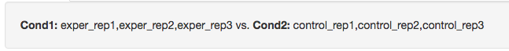

If you can select the type of plot at the bottom of the filter tab.

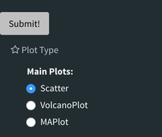
	
You can download the results in CSV or TSV format by selecting your 'File type' and clicking the 'download' button once you've ran DESeq.
You can also download the plot or graphs themselves by clicking on the gear in the upper-left corner of each plot or graph.

Quality Control Plots
=====================

Selecting the 'QC Plots' tab will take you to the quality control plots
section.  These QC plots are very similar to the QC plots shown before
running DESeq and the dataset being used here depends on the one
you select in the left panel.  In addition to the all-to-all plot shown
within the previous QC analysis, users can also view a heatmap,PCA, IQR, and density
plots of their analyzed data by selecting the proper plot on the left
menu.  You can also choose the appropriate clustering and distance method you would
like to use for this heatmap just abot the plot just like in the previous QC section.

For additional information about the clustering methods used, you can consult `this website`_.

.. _this website: http://www.inside-r.org/r-doc/stats/hclust

For additional information about the distance methods used, you can consult `here`_.

.. _here: http://www.inside-r.org/r-doc/stats/dist

For distances other than 'cor', the distance function defined will be ( 1 - (the correlation between samples)).
Each qc plot also has options to adjust the plot height and width, as well as a download button for a pdf output located above each plot.
For the Heatmap, you can also view an interactive session of the heatmap by selecting the 'Interactive' checkbox before submitting your
heatmap request.  Make sure that before selecting the interactive heatmap option that your dataset being used is 'Up+down'.
Just like in the Main Plots, you can click and drag to create a selection.  To select a specific portion of the heatmap, make sure
to highlight the middle of the heatmap gene box in order to fully select a specific gene.  This selection can be used later within the
GO Term plots for specific queries on your selection.

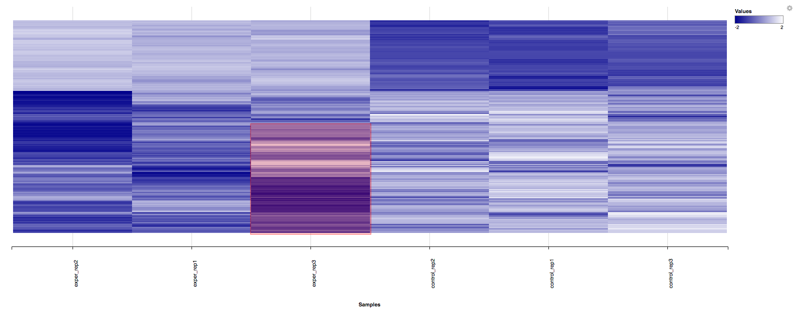
	
Your selection will also zoom in for better viewing resolution.
	
.. image:: ../debrowser_pics/interactive_heatmap_zoom.png
	:align: center
	
Heat Maps
=========
The heatmap is a great way to analyze replicate results of genes all in
one simple plot (Figure 17).  Users have the option to change the clustering method used
as well as the distance method used to display their heatmap.  In addition,
you can also change the size of the heatmap produced and adjust the p-adjust
and fold change cut off for this plot as well.  Once all of the parameters
have been set, click the 'Submit!' button at the bottom of the left menu to
generate your heatmap.

## Used clustering and linkage methods in heatmap

* **complete:**
	Complete-linkage clustering is one of the linkage method used in hierarchical clustering.
	In each step of clustering, closest cluster pairs are always merged up to a specified distance     threshold. Distance between clusters for complete link clustering is the maximum of
	the distances between the members of the clusters.
	
* **ward D2:**
	Ward method aims to find compact and spherical clusters. The distance between two clusters 
	is calculated by the sum of squared deviations from points to centroids. "ward.D2" method uses
	criterion (Murtagh and Legendre 2014) to minimize ward clustering method. The only difference
	ward.D2 and ward is the dissimilarities from ward method squared before cluster updating. This
	method tends to be sensitive to the outliers.

* **single:**
	Distance between clusters for single linkage is the minimum of	the distances between 
	the members of the clusters.
	
* **average:**
	Distance between clusters for average linkage is the average of the distances between 
	the members of the clusters.

* **mcquitty:**
	mcquitty linkage is when two clusters are joined, the distance of the new cluster 
	to any other cluster is calculated by the average of the distances of the soon to be 
	joined clusters to that other cluster.
	
* **median:**
	This is a different averaging method that uses the median instead of the mean.
	It is used to reduce the effect of outliers.

* **centroid:**
	The distance between cluster pairs is defined as the Euclidean distance 
	between their centroids or means.

## Used distance methods in heatmap

* **cor:**
	1 - cor(x) are used to define the dissimilarity between samples. It is less
	sensitive to the outliers and scaling.

* **euclidean:**
	It is the most common use of distance. It is sensitive to the outliers and scaling. 
	It is defined as the square root of the sum of the square differences between gene counts.

* **maximum:**
	The maximum distance between two samples is the sum of the maximum expression value of the 
	corresponding genes.

* **manhattan:**
	The Manhattan distance between two samples is the sum of the differences of their 
	corresponding genes.

* **canberra:**
	Canberra distance is similar to the Manhattan distance and it is a special form of 
	the Minkowski distance. The difference is that the absolute difference between the 
	gene counts of the two genes is divided by the sum of the absolute counts 
	prior to summing. 
	
* **minkowsky:**
	It is generalized form of euclidean distance.
	 
You can also select to view an interactive version of the heatmap by clicking
on the 'Interactive' checkbox on the left panel under the height and width
options.  Selecting this feature changes the heatmap into an interactive
version with two colors, allowing you to select specific genes to be compared
within the GO term plots.  In order to use the interactive heatmap selection
within your GO term query, you must use either the up+down dataset or the
most varied dataset for the heatmap display.
	
GO Term Plots
=============

The next tab, 'GO Term', takes you to the ontology comparison portion of
DEBrowser.  From here you can select the standard dataset options such as
p-adjust value, fold change cut off value, which comparison set to use, and
which dataset to use on the left menu.  In addition to these parameters, you
also can choose from the 4 different ontology plot options: 'enrichGO',
'enrichKEGG', 'Disease', and 'compareCluster'.  Selecting one of these plot
options queries their specific databases with your current DESeq results.

.. image:: ../debrowser_pics/go_plots_opts.png
	:align: center
	
Your GO plots include:

* enrichGO - use enriched GO terms
* enrichKEGG - use enriched KEGG terms
* Disease - enriched for diseases
* compareClusters - comparison of your clustered data

The types of plots you will be able to generate include:

Summary plot:

.. image:: ../debrowser_pics/go_summary.png
	:align: center

GOdotplot:

.. image:: ../debrowser_pics/go_dot_plot.png
	:align: center

Changing the type of ontology to use will also produce custom parameters for that specific ontology at the bottom of the
left option panel.

Once you have adjusted all of your parameters, you may hit the submit button in the top right and then wait
for the results to show on screen!
	
Data Tables
===========

The lasttab at the top of the screen displays various different data tables.
These datatables include:

* All Detected
* Up Regulated
* Down Regulated
* Up+down Regulated
* Selected scatterplot points
* Most varied genes
* Comparison differences

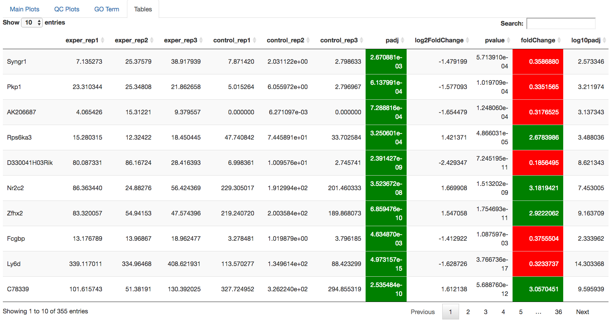
	
All of the tables tables, except the Comparisons table, contain the following information:

* ID - The specific gene ID
* Sample Names - The names of the samples given and they're corresponding tmm normalized counts
* Conditions - The log averaged values
* padj - padjusted value
* log2FoldChange - The Log2 fold change
* foldChange - The fold change
* log10padj - The log 10 padjusted value

The Comparisons table generates values based on the number of comparisons you have conducted.
For each pairwise comparison, these values will be generated:

* Values for each sample used 
* foldChange of comparison A vs B
* pvalue of comparison A vs B
* padj value of comparison A vs B

.. image:: ../debrowser_pics/comparisons.png
	:align: center
	
You can further customize and filter each specific table a multitude of ways.  For unique table or dataset options, select the type of
table dataset you would like to customize on the left panel under 'Choose a dataset' to view it's additional options.
All of the tables have a built in search function at the top right of the table and you can further sort the table
by column by clicking on the column header you wish to sort by.  The 'Search' box on the left panel allows for multiple searches via
a comma-seperated list.  You can additionally use regex terms such as "^al" or "\*lm" for even more advanced searching.
This search will be applied to wherever you are within DEBrowser, including both the plots and the tables.
